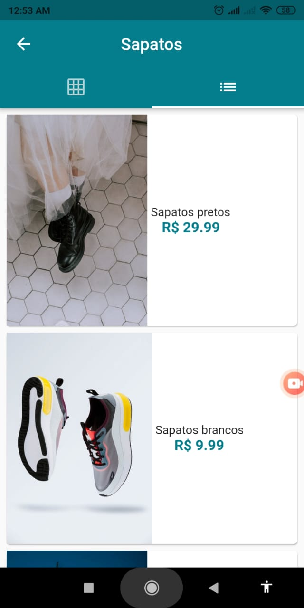

# loja_virtual
 Virtual Store app made in flutter and firebase as backend.
 
 ## Functionalities
 * See the stores' location on google maps and call them.
 * Login with email and password
 * Create new account
 * Add items to cart
 * Finish purchase
 * Apply discount cupons
 * Track purchase status
 
 
## Screens:

